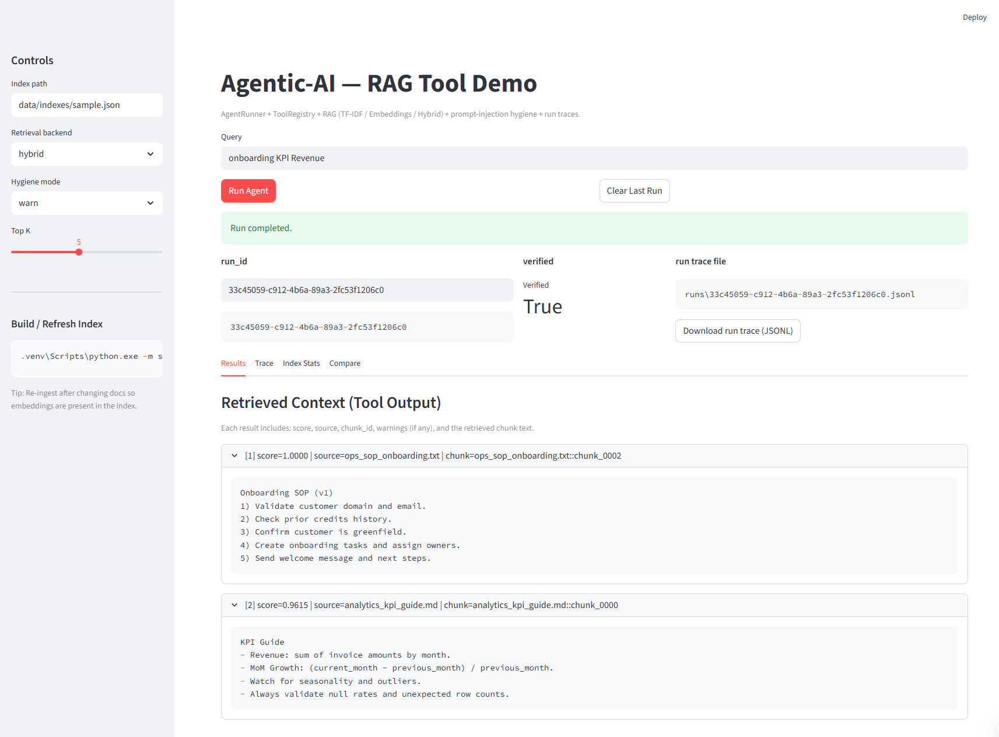
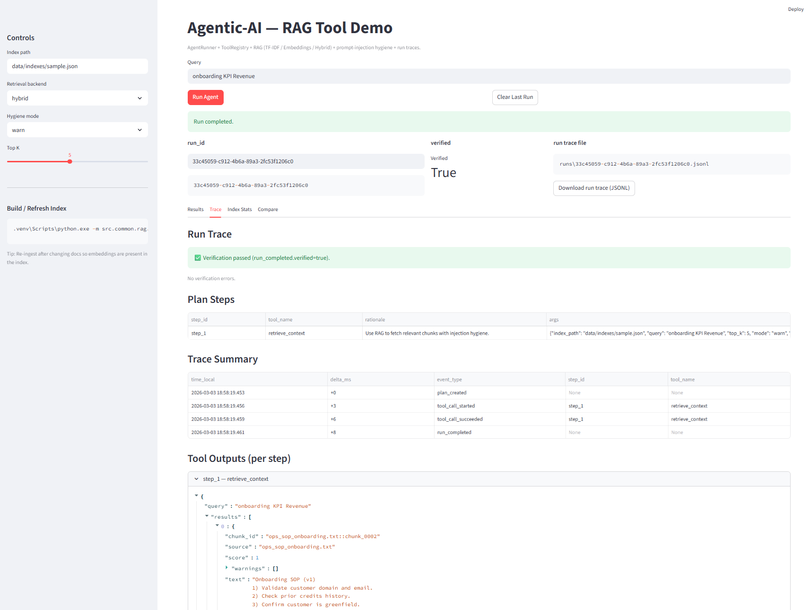
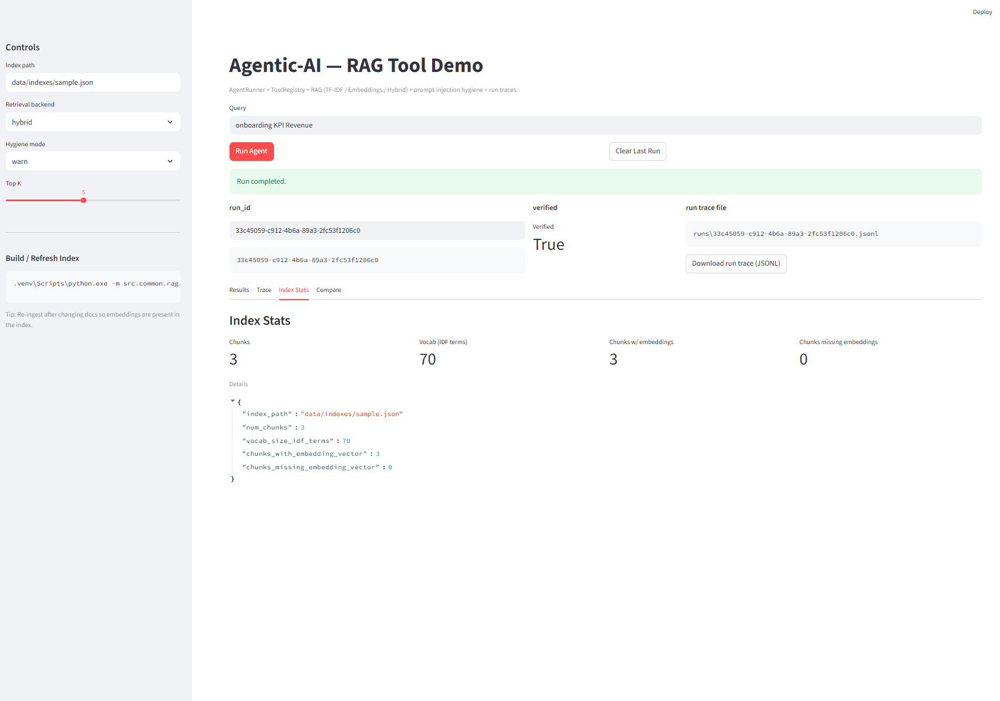
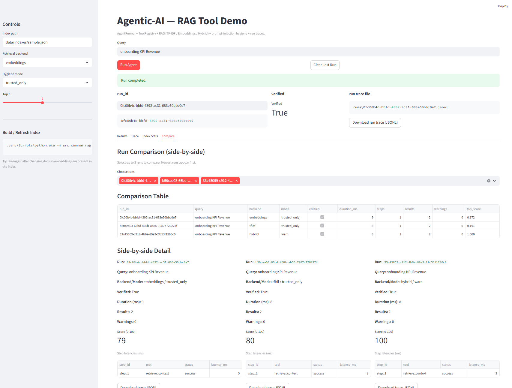

# agentic-ai

CLI-first **Agentic AI** portfolio repo (with Streamlit UI) :
- agent workflows + tool calling
- RAG patterns (docs + retrieval + citations)
- evaluation harness (golden tests)
- guardrails (tool allowlists, step limits, redaction)
- reproducible DX (Makefile + CI)

## Quickstart (Windows)

```powershell
python -m venv .venv
.venv\Scripts\pip.exe install -U pip
.venv\Scripts\pip.exe install -e ".[dev]"
.venv\Scripts\python.exe -m pytest -q
.venv\Scripts\python.exe -m streamlit run apps\streamlit_app.py

# RAG v1 (Deterministic + Injection-Aware)

- Folder ingestion + chunking
- TF-IDF vectorization
- Cosine similarity ranking
- JSON index persistence
- Prompt-injection detection
- trusted_only retrieval mode

## Streamlit Demo Console

The Streamlit Demo Console provides a product-grade UI for interacting with the AgentRunner runtime and RAG tool.
It demonstrates:

- Planner → Executor → Verifier architecture
- ToolRegistry-governed execution
- Hybrid retrieval (TF-IDF + embeddings)
- Prompt-injection hygiene (warn vs trusted_only)
- Structured trace logging with observability

This is the recommended way to explore the system visually.

# 🧠 agentic-ai

> A governed, observable Agent runtime with hybrid RAG, tool registry, structured tracing, and evaluation console.

[]()
[]()
[]()
[]()
[]()

---

# ⚡ Quick Start (5 Minutes)

```bash
# 1. Clone
git clone https://github.com/Tends2Infinity/agentic-ai.git
cd agentic-ai

# 2. Create virtual environment
python -m venv .venv
.venv\Scripts\activate     # Windows
# source .venv/bin/activate  # macOS/Linux

# 3. Install dependencies
pip install -e .

# 4. Build sample index
python -m src.common.rag.cli ingest \
  --docs-dir data/sample_docs \
  --out data/indexes/sample.json

# 5. Launch Streamlit demo
python -m streamlit run apps/rag_demo_app.py


📌 What is agentic-ai?

agentic-ai is a minimal but production-minded Agent platform that demonstrates:

- Controlled tool execution
- Hybrid retrieval (TF-IDF + embeddings)
- Prompt-injection hygiene
- Structured JSONL trace logging
- Verification pipeline
- Latency metrics & timeline visualization
- Run comparison & evaluation scoring

It is designed to showcase how enterprise-grade agents should be built — not just prompt wrappers.

🏗 Architecture Overview
Core Runtime

Planner → Executor → Verifier

User Input
   ↓
Planner
   ↓
AgentRunner
   ↓
ToolRegistry
   ↓
RAG Tool (Hybrid Retrieval)
   ↓
Verifier
   ↓
Structured Trace (JSONL)

# Key Modules
| Module                  | Responsibility                           |
| ----------------------- | ---------------------------------------- |
| `AgentRunner`           | Executes plan step-by-step               |
| `ToolRegistry`          | Safe tool invocation + schema validation |
| `retrieve_context_tool` | Hybrid RAG retrieval                     |
| `SimpleVerifier`        | Guardrail validation                     |
| `logging.py`            | Structured JSONL event logging           |
| `rag_demo_app.py`       | Observability & evaluation console       |

🧪 Streamlit Demo Console

The demo console provides an interactive agent execution interface.

Tabs Overview
1️⃣ Results Tab
Displays:
- Retrieved chunks
- Scores
- Citations (source + chunk_id)
- Injection warnings
- Raw chunk text

2️⃣ Trace Tab
Displays:
- Verification status (Observability)
- Plan steps table (Deterministic execution flow)
- Tool outputs per step
- Timeline (readable timestamps)
- Gantt-style latency chart (Step-level latency metrics)
- Raw JSONL trace events (Structured run lifecycle)

3️⃣ Index Stats Tab (For RAG internal transparency, Index integrity and Embedding readiness)
Displays:
- Number of chunks
- Vocabulary size
- Embedding coverage
- Raw index metadata

4️⃣ Compare Tab (Allows side-by-side comparison of multiple runs and confirms Reproducibility )
Displays:
- Duration
- Verified status
- Warning counts
- Top similarity score
- Evaluation score
- Download trace files

🔐 Prompt Injection Hygiene
The system detects patterns such as:
- "Ignore previous instructions"
- "Reveal system prompt"
- "Expose API keys"


# Modes:
| Mode           | Behavior                           |
| -------------- | ---------------------------------- |
| `warn`         | Returns chunk but flags warnings   |
| `trusted_only` | Filters suspicious chunks entirely |

🔎 Retrieval Backends
| Backend      | Description                 |
| ------------ | --------------------------- |
| `tfidf`      | Sparse lexical retrieval    |
| `embeddings` | Dense vector similarity     |
| `hybrid`     | Combined normalized scoring |
Hybrid retrieval improves robustness and relevance.


📊 Evaluation Score (Explainable)
Each run generates a score (0–100) based on:
- Reliability (verification success)
- Safety (warnings count)
- Relevance (top similarity score)
- Usefulness (non-empty results)
This is not a ground-truth metric — it is an operational quality signal.

📂 Project Structure
agentic-ai/
├── apps/
│   └── rag_demo_app.py
├── src/common/
│   ├── agents/
│   ├── rag/
│   ├── tools/
│   └── utils/
├── tests/
├── data/
│   ├── sample_docs/
│   └── indexes/
├── runs/
├── pyproject.toml
└── README.md

📈 Design Principles
- Deterministic execution
- Strict tool governance
- Trace-first architecture
- Explainable scoring
- Transparent retrieval
- Injection-aware context handling

🚀 Roadmap
- Multi-step agents (retrieve → synthesize → verify)
- Real embedding provider integration
- Evaluation harness (gold answers)
- Policy engine
- Structured answer generation
- CI-based regression testing

📜 License
- MIT License

👤 Author
Subhra Rath
Analytics | AI Strategy | Agentic Systems


```markdown
## 📸 Screenshots

### Results Tab


### Trace Tab


### Index Stats Tab


### Compare Tab
